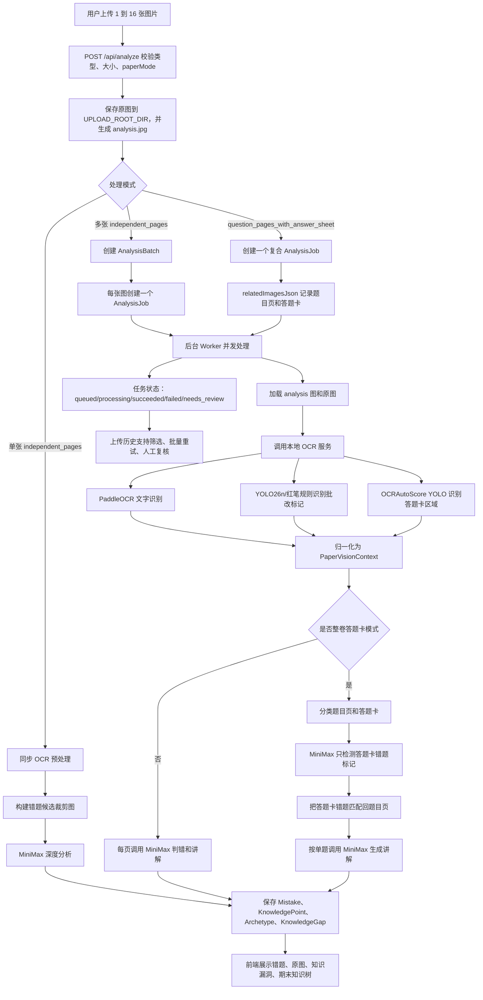

# Private Tutor Agent

单个孩子使用的初中全学科私人教师 Web Agent。系统面向孩子错题整理：上传试卷或习题照片后，先做本地 OCR 和批改痕迹识别，再调用 MiniMax 中国国内站 API 判断错题、生成孩子能理解的讲解、沉淀错题本、知识漏洞、母题和期末知识树。

## 当前能力

- 单个孩子版本，默认学生 ID 为 `default-student`。
- 支持初中全学科：语文、数学、英语、物理、化学、生物、历史、地理、道德与法治。
- 支持 JPG、PNG、WebP、HEIC/HEIF，单张最大 8MB，一次最多 16 张。
- 学科、年级可以不选，AI 根据图片内容自动识别。
- 支持两种试卷模式：
  - `independent_pages`：逐张图片独立判题。
  - `question_pages_with_answer_sheet`：整卷识别，自动区分题目页和答题卡，并把答题卡错题匹配回题目页。
- 多图和整卷模式走异步任务队列，上传历史能看到每页 AI 是否成功、是否待复核，并支持批量重试。
- OCR 前置识别文字块、题号、版面区域、红笔批改、YOLO 批改标记和疑似错题候选。
- MiniMax 负责最终错题判断、深入浅出讲解、知识漏洞、母题、例题和深圳题型风格练习。
- 同一张卷子反复提交时，同一错题不会重复叠加错误次数。
- 同类母题多次出错会在知识漏洞和期末知识树中重点标记。
- 错题详情、知识漏洞详情、知识树详情都能下钻到知识点解释，并关联原始上传图片和错题。
- AI 对话有学习范围限制，会拦截游戏、娱乐视频、闲聊和绕过规则类请求。

## 技术栈

- Web: Next.js 15, React 19, TypeScript
- 数据库: SQLite + Prisma
- AI: MiniMax Chat Completions API
- OCR: Flask + PaddleOCR + Pillow
- 批改与答题卡视觉: YOLO26n + SAHI, OCRAutoScore YOLO, 红笔像素 fallback

## 试卷处理过程



## 核心处理链路

### 1. 前端上传

入口组件：`src/components/PhotoUploadTutor.tsx`

1. 用户选择 1 到 16 张图片。
2. 前端用 `FormData` 的 `files` 字段提交图片。
3. 可选提交 `subjectHint`、`gradeHint`、`paperMode`。
4. 请求 `POST /api/analyze`。
5. 单图同步返回解析结果；多图或整卷返回 `202` 和 `AnalysisBatch`，前端轮询 `/api/analysis-batches/[id]`。
6. 页面按图片分组展示原图、OCR 摘要、错题解析、任务状态和重试入口。

### 2. 上传校验、落盘和分析图生成

入口：`src/app/api/analyze/route.ts`

1. 校验文件数量、类型和大小。
2. 原图保存到 `getUploadRootDir()`：
   - 默认是项目根目录下的 `uploads/`。
   - 如果设置 `UPLOAD_ROOT_DIR`，则保存到该目录。
3. 数据库里存储的是 `uploads/<filename>` 形式的相对路径。
4. 非测试环境会用 macOS `sips` 生成 `*-analysis.jpg`：
   - 默认最长边 `1600`。
   - 默认 JPEG 质量 `75`。
   - 可用 `ANALYSIS_IMAGE_MAX_DIMENSION` 和 `ANALYSIS_IMAGE_QUALITY` 调整。
5. HEIC/HEIF 也会转换成 JPEG 分析图；转换失败时会提示改用 JPG、PNG 或 WebP。

图片访问入口：`src/app/api/uploads/[filename]/route.ts`。该接口通过 `resolveStoredUploadPath()` 从 `UPLOAD_ROOT_DIR` 或默认 `uploads/` 读取文件。

### 3. 单图同步分析

单张 `independent_pages` 仍走同步路径：

1. 调用 `analyzeImageWithOcr()` 做 OCR 预处理。
2. 根据 OCR 的 `mistakeCandidates` 用 `sharp` 裁剪最多 8 张候选区域图。
3. 把整页分析图、候选裁剪图、OCR 证据层一起传给 MiniMax。
4. 保存分析结果到错题本、知识漏洞和母题。
5. 返回 `imageGroups`，前端立即展示。

### 4. 多图异步分析

多张 `independent_pages` 会创建：

- 一个 `AnalysisBatch`
- 每张图片一个 `AnalysisJob`

`triggerAnalysisWorker()` 会在当前 Next.js 进程中启动后台 Worker。Worker 每轮最多 claim 4 个 queued job，并发处理。每个 job 都会保存：

- `paperVisionContextJson`
- `analysesJson`
- `savedMistakesJson`
- `status`
- `errorMessage`

状态会汇总回 `AnalysisBatch.status`。上传历史页可以展示每张图是否解析成功、是否失败、是否待人工复核。

### 5. 整卷题目页加答题卡分析

当 `paperMode=question_pages_with_answer_sheet` 时，上传的多张图会作为一个复合 job 处理：

1. `relatedImagesJson` 保存全部图片，初始 role 都是 `unknown`。
2. Worker 逐页 OCR，并用 `classifyCompositePageRole()` 判断 `question`、`answer_sheet` 或 `unknown`。
3. OCR 服务如果检测到答题卡区域，会返回 `pageRoleHint=answer_sheet`。
4. 系统对答题卡页做额外检测：
   - 宽图会切成左右和上下区域，降低 MiniMax 输出截断概率。
   - `detectAnswerSheetMistakesWithMiniMax()` 只负责识别答题卡上的红叉、半勾、半叉、扣分数字。
   - 只接受置信度不低于 `0.6` 的候选。
5. `matchAnswerSheetMistakes()` 用题号和相邻页规则，把答题卡错题匹配回题目页。
6. 对每个匹配成功的错题，单独调用 MiniMax 生成讲解。
7. 匹配失败、仅 OCR 结果或不确定结果会进入 `needs_review`，避免把不可靠结论直接当成错题。

### 6. OCR 服务

入口：`ocr_service/app.py`

Web 端通过 `src/lib/ocr/client.ts` 调用 `OCR_SERVICE_URL`。请求会同时带：

- `image`：1600px 左右的分析图，用于 OCR。
- `originalImage`：原始上传图，用于 YOLO 批改标记检测。

OCR 服务返回并归一化为 `PaperVisionContext`：

- `rawText`
- `textBlocks`
- `questionCandidates`
- `layoutRegions`
- `gradingMarks`
- `mistakeCandidates`
- `debugArtifacts`
- `pageRoleHint`

OCR 服务内部步骤：

1. Pillow 打开图片，并按 `OCR_MAX_SIDE` 缩放，默认最长边 1800。
2. PaddleOCR 识别文字、坐标、置信度。
3. OCRAutoScore YOLO 检测答题卡作答区域；模型不存在时自动禁用。
4. YOLO26n + SAHI 在原图上检测老师批改标记；模型不存在或失败时退回红笔像素规则。
5. `normalization.py` 把文字块、题号、批改标记绑定成疑似错题候选。

如果 OCR 请求失败，Web 端不会直接中断分析，而是生成 `status=failed` 的 OCR context，让 MiniMax 继续使用原图视觉能力分析。

### 7. MiniMax 分析和 JSON 修复

入口：`src/lib/analyzer/index.ts`、`src/lib/analyzer/minimax.ts`

当 `MINIMAX_API_KEY` 存在且传入图片时，系统调用 MiniMax；否则走 `src/lib/analyzer/simulated.ts` 的模拟结果。

MiniMax 输入包含：

- 原始或压缩后的分析图片。
- OCR 证据层。
- 候选错题裁剪图。
- 学科、年级提示或自动识别要求。
- 试卷模式、页面角色、目标题号。

Prompt 要求模型：

- 尽量找出整张图片里所有可识别错题，而不是只返回第一题。
- 同时使用老师批改标记和独立解题对比学生答案。
- 优先识别红色老师批改；黑笔叉号不能直接当成错题。
- 识别半勾、半叉、扣分、远离题干的学生答案和涂改较多的答案。
- 生成孩子能听懂的讲解、知识树上下文、类比、插图结构、例题、深圳题型风格练习和母题。

MiniMax 输出必须是 JSON。代码会做多层兜底：

1. 直接解析 JSON。
2. 去除 `<think>`、前后缀文本、多余 Markdown。
3. 截取第一个 JSON 对象。
4. 修复常见类 JSON 问题。
5. 请求 MiniMax 把坏 JSON 修复为严格 JSON。
6. 必要时发紧凑修复请求。
7. 如果视觉请求超时且 OCR 可用，尝试 OCR-only 分析。
8. 如果 AI 漏掉高置信 OCR 候选，尝试覆盖扩展。

`ENABLE_AI_FALLBACK=true` 时，MiniMax 失败会退回 mock。调试真实 AI 时建议保持 `false`，否则问题会被模拟结果掩盖。

### 8. 保存错题、知识漏洞和母题

入口：`src/lib/repositories/mistakes.ts`

每道分析结果会进入事务：

1. 取 `knowledgePoints[0]` 作为主知识点。
2. 按 `subject + grade + name` upsert `KnowledgePoint`。
3. 按 `subject + grade + knowledgePointId + title` upsert `Archetype`。
4. 用题干归一化和 bigram 相似度判断重复错题。
5. 如果同一错题已经存在，不新增错题，也不重复叠加错误次数。
6. 新错题写入 `Mistake`，并关联 `MistakeArchetype`。
7. 写入初始 `TutorMessage`。
8. 重新统计同知识点错题数和同母题重复数，更新 `KnowledgeGap`。

漏洞严重程度：

- `normal`：普通错题。
- `weak`：同知识点错题数达到 2。
- `important`：同知识点错题数达到 3。
- `repeated_archetype`：同母题重复出错达到 2。

人工复核会影响统计：确认不是错题的记录不会继续计入活跃知识漏洞。

## 页面和接口

### 页面

- `/`：上传试卷、查看本次分析、AI 分析历史和对话历史。
- `/uploads`：上传历史、状态筛选、失败重试、批量重试。
- `/mistakes`：错题本列表。
- `/mistakes/[id]`：错题详情，包含原始上传照片、解析、母题和追问记录。
- `/gaps`：知识漏洞列表，可下钻到知识点详情。
- `/tree`：按学科和年级查看期末知识树，可下钻到知识点详情。
- `/knowledge-points/[id]`：知识点详情，包含通俗讲解、类比、知识树位置、例题、深圳题型风格练习、母题和关联错题。
- `/review`：人工复核。
- `/practice`：错题练习。
- `/teacher`：教师视角页面。

### API

- `POST /api/analyze`：上传并启动分析。
- `GET /api/analysis-batches/[id]`：查询异步批次状态和结果。
- `POST /api/analysis-batches/[id]/retry`：重试失败任务。
- `GET /api/upload-history`：上传历史列表和汇总。
- `POST /api/upload-history/retry`：按上传记录或 job 批量重试，带图片 hash 去重。
- `GET /api/uploads/[filename]`：读取原始上传图片或分析图。
- `GET /api/history`：首页分析历史。
- `GET /api/mistakes`、`GET /api/mistakes/[id]`：错题列表和详情。
- `GET /api/knowledge-gaps`：知识漏洞列表。
- `GET /api/knowledge-tree`：期末知识树。
- `GET /api/knowledge-points/[id]`：知识点讲解详情。
- `POST /api/chat`：围绕错题追问，带学习范围限制。
- `POST /api/review-mistakes`：人工复核错题。
- `POST /api/practice-set`：生成练习。

## 本地环境要求

### Node.js

建议 Node.js 22 或更高版本。项目依赖 `@types/node@22`，当前 Next.js 版本为 15。

```bash
node --version
npm --version
```

### Python

OCR 服务建议 Python 3.11。不要优先使用系统 Python 3.14，因为 PaddleOCR/PaddlePaddle 的 wheel 对 Python 版本和平台更敏感。

```bash
python3 --version
```

Apple Silicon 或不同 CPU/GPU 环境需要安装匹配硬件和 Python 版本的 PaddlePaddle wheel。

### 系统依赖

- macOS 本地开发可直接使用 `sips` 生成分析图和转换 HEIC。
- 非 macOS 环境建议上传 JPG、PNG 或 WebP，或自行替换图片压缩转换实现。
- YOLO 检测默认使用 `mps`，CPU 环境可设置 `OCR_GRADING_DEVICE=cpu`。

## 安装和启动

### 1. 安装 Web 依赖

```bash
npm install
```

### 2. 配置环境变量

```bash
cp .env.example .env.local
```

关键配置：

```env
DATABASE_URL="file:./dev.db"
MINIMAX_API_KEY="你的 MiniMax API Key"
MINIMAX_BASE_URL="https://api.minimaxi.com/v1"
MINIMAX_MODEL="MiniMax-M3"
MINIMAX_MAX_COMPLETION_TOKENS="16000"
MINIMAX_TIMEOUT_MS="90000"
ENABLE_AI_FALLBACK="false"
OCR_SERVICE_URL="http://127.0.0.1:5005/ocr"
OCR_TIMEOUT_MS="120000"
OCR_DEBUG_ARTIFACTS="false"
```

常用可选配置：

```env
UPLOAD_ROOT_DIR="/absolute/path/to/uploads"
ANALYSIS_IMAGE_MAX_DIMENSION="1600"
ANALYSIS_IMAGE_QUALITY="75"
ANALYZE_IMAGE_CONCURRENCY="4"
OCR_IMAGE_CONCURRENCY="2"
OCR_SERIALIZE_REQUESTS="true"
```

说明：

- `UPLOAD_ROOT_DIR` 不设置时，图片保存在项目根目录 `uploads/`。
- `OCR_SERIALIZE_REQUESTS` 默认不是 `false` 时会串行调用 OCR，降低 PaddleOCR 并发崩溃概率。
- `ENABLE_AI_FALLBACK=false` 可以暴露真实 MiniMax 错误，排障时建议保持 false。
- API Key 不要提交到 Git。

### 3. 初始化数据库

```bash
npm run prisma:generate
npm run prisma:migrate
npm run prisma:seed
```

### 4. 启动 OCR 服务

推荐使用独立 Python 3.11 环境：

```bash
python3.11 -m venv .venv-ocr
source .venv-ocr/bin/activate
pip install -r ocr_service/requirements.txt
pip install paddlepaddle
python3 ocr_service/app.py
```

健康检查：

```bash
curl http://127.0.0.1:5005/health
```

返回里会显示：

- `layoutDetector`: `ocrautoscore-yolov8` 或 `disabled`
- `gradingDetector`: `yolo26n-hard-v2-sahi` 或 `red-ink-fallback`

如果没有放置本地模型文件，系统仍可运行，但会少一层视觉检测能力。

### 5. 可选 OCR 模型配置

答题卡区域模型：

```env
OCR_LAYOUT_ENABLED="true"
OCR_LAYOUT_MODEL_PATH="/absolute/path/to/answer_sheet_layout.pt"
OCR_LAYOUT_CONFIDENCE="0.25"
OCR_LAYOUT_IMAGE_SIZE="640"
OCR_LAYOUT_TIMEOUT_SECONDS="45"
```

批改标记模型：

```env
OCR_GRADING_ENABLED="true"
OCR_GRADING_MODEL_PATH="/absolute/path/to/error_mark_yolo26n_hard_v2.pt"
OCR_GRADING_DEVICE="mps"
OCR_GRADING_CANDIDATE_CONFIDENCE="0.03"
OCR_GRADING_FINAL_CONFIDENCE="0.40"
OCR_GRADING_AUTO_CONFIDENCE="0.80"
OCR_GRADING_SLICE_SIZE="640"
OCR_GRADING_OVERLAP="0.20"
OCR_GRADING_NMS_IOU="0.50"
OCR_GRADING_TIMEOUT_SECONDS="90"
```

调试 OCR 可视化：

```env
OCR_DEBUG_ARTIFACTS="true"
OCR_DEBUG_OUTPUT_DIR="/absolute/path/to/tmp/ocr-debug"
```

启用后 `/ocr` 响应会带 `debugArtifacts`，并可通过 `http://127.0.0.1:5005/debug-artifacts/<filename>` 查看叠加图。

### 6. 启动 Web

```bash
npm run dev
```

打开：

```text
http://localhost:3000
```

如果 3000 被占用，Next.js 会提示实际端口。

## 测试和检查

```bash
npm run lint
npm run test
npm run ocr:test
npm run build
```

单独测试 OCR 服务：

```bash
PYTHONPATH=ocr_service python3 -m unittest discover -s ocr_service/tests
```

## 常见排障

### 上传后 `uploads/` 为空

检查是否设置了 `UPLOAD_ROOT_DIR`。当前代码会优先保存到该目录，而不是项目根目录下的 `uploads/`。

### OCR 预处理失败

1. 先检查 OCR 服务是否存活：

```bash
curl http://127.0.0.1:5005/health
```

2. 检查 `.env.local` 的 `OCR_SERVICE_URL` 是否指向 `/ocr`。
3. PaddleOCR 首次加载较慢，`OCR_TIMEOUT_MS` 建议不低于 `120000`。
4. 如果 YOLO 或 layout 模型失败，OCR 服务会记录日志并退回其它路径；一般不会导致整次分析中断。

### MiniMax 返回坏 JSON

常见原因是单次请求图片太多、图片内容过密、模型输出超长、或模型额外输出思考文本。当前代码已经做 JSON 截取、修复、二次修复、紧凑修复和 OCR-only 兜底。仍失败时，多图会把单页标成 `failed` 或 `needs_review`，可以在上传历史里批量重试。

### 多张图片只有 OCR，没有 AI 解析

看上传历史里的 job 状态：

- `failed`：AI 或文件读取失败，可重试。
- `needs_review`：AI 认为结果不可靠，或答题卡错题没有匹配到题目页。
- `succeeded`：已经保存可展示错题。

整卷答题卡模式下，题目页和答题卡页必须一起上传；如果答题卡题号不清晰，匹配会更容易进入 `needs_review`。

### 黑笔叉被误判为错题

当前 prompt 和 OCR 规则都要求优先识别红色老师批改。黑笔叉通常视为学生排除选项，不直接判错。若仍出现误判，可以在人工复核页标记为不是错题；该记录不会计入知识漏洞。

### 同一错题重复提交导致统计异常

保存层会按同学科、同年级的归一化题干和相似度做去重。人工已复核的相似错题也会被优先识别，避免重复叠加错误次数。

## 目录结构

```text
src/app/                         Next.js 页面和 API
src/components/                  上传、错题、知识树、复核等前端组件
src/lib/analysis/jobs.ts          异步分析队列和重试逻辑
src/lib/analyzer/minimax.ts       MiniMax 调用、提示词、JSON 修复
src/lib/ocr/client.ts             Web 端 OCR 客户端
src/lib/repositories/mistakes.ts  错题保存、去重、知识漏洞统计
src/lib/knowledge/                知识树和知识点详情
src/lib/uploads.ts                上传目录解析
ocr_service/                      Flask OCR 服务
ocr_service/grading.py            YOLO26n 批改标记检测入口
ocr_service/layout.py             OCRAutoScore 答题卡区域检测入口
prisma/schema.prisma              数据模型
```

## 数据模型要点

- `Mistake`：错题、原图路径、AI 判断、人工复核状态、富内容状态。
- `KnowledgePoint`：按学科、年级、知识点组织。
- `KnowledgeGap`：单个孩子在某知识点上的漏洞统计。
- `Archetype`：母题。
- `MistakeArchetype`：错题和母题关联。
- `TutorMessage`：围绕错题的对话历史。
- `AnalysisBatch`：一次异步上传批次。
- `AnalysisJob`：批次里的单页任务或整卷复合任务。

## 当前工程边界

- 当前是单孩子本地版本，没有账号体系和多孩子权限隔离。
- 后台 Worker 运行在 Next.js 进程内，不是独立队列服务；生产环境建议迁移到 BullMQ、Sidekiq、Celery 或托管任务队列。
- MiniMax 解析质量受图片清晰度、OCR 质量和模型输出稳定性影响；高风险结果会进入人工复核。
- 深圳题型风格练习是基于错题生成的风格化练习，不是直接引用真实真题原文。
